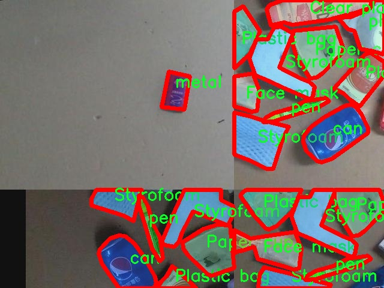

# 日常物品图像分割系统源码＆数据集分享
 [yolov8-seg-C2f-DySnakeConv＆yolov8-seg-C2f-RFCAConv等50+全套改进创新点发刊_一键训练教程_Web前端展示]

### 1.研究背景与意义

项目参考[ILSVRC ImageNet Large Scale Visual Recognition Challenge](https://gitee.com/YOLOv8_YOLOv11_Segmentation_Studio/projects)

项目来源[AAAI Global Al lnnovation Contest](https://kdocs.cn/l/cszuIiCKVNis)

研究背景与意义

随着计算机视觉技术的快速发展，物体检测与图像分割在日常生活中的应用愈发广泛。尤其是在智能家居、自动驾驶、安防监控等领域，如何高效、准确地识别和分割图像中的物体，成为了研究者们关注的焦点。YOLO（You Only Look Once）系列模型因其高效的实时检测能力而受到广泛欢迎。YOLOv8作为该系列的最新版本，结合了深度学习的最新进展，展现出了更为优越的性能。然而，尽管YOLOv8在物体检测方面表现出色，但在细粒度的图像分割任务中仍然存在一定的局限性。因此，基于改进YOLOv8的日常物品图像分割系统的研究具有重要的学术价值和实际意义。

本研究所使用的数据集包含2600张图像，涵盖17个类别的日常物品，包括透明塑料瓶、口罩、玻璃、纸盒、纸杯、塑料袋、泡沫、罐子、充电器、金属、笔、毛绒玩具、螺丝刀、海绵、牙刷和毛巾等。这些物品不仅在我们的日常生活中普遍存在，而且在环境保护、垃圾分类等社会问题中扮演着重要角色。通过对这些物品进行精确的图像分割，可以为后续的智能识别、分类和处理提供可靠的数据支持，进而推动相关领域的研究与应用。

在环境保护日益受到重视的背景下，物品的智能识别与分类尤为重要。通过对日常物品进行有效的图像分割，可以实现对可回收物品与不可回收物品的自动识别，从而提高垃圾分类的效率，减少环境污染。此外，随着智能家居设备的普及，用户对家居环境的智能化管理需求日益增长。基于改进YOLOv8的图像分割系统能够帮助智能家居设备更好地理解和处理周围环境，提高设备的智能化水平。

此外，本研究还将推动深度学习与计算机视觉领域的技术进步。通过对YOLOv8模型的改进，探索其在图像分割任务中的应用，能够为后续的研究提供新的思路和方法。特别是在数据集的构建与标注方面，本研究将采用先进的标注工具与技术，确保数据集的高质量和多样性，从而为模型的训练提供更为丰富的样本。

综上所述，基于改进YOLOv8的日常物品图像分割系统的研究，不仅具有重要的理论意义，还具备广泛的应用前景。通过对日常物品的精准识别与分割，可以为环境保护、智能家居等领域提供强有力的技术支持，推动社会的可持续发展。因此，本研究的开展将为相关领域的学术研究与实际应用贡献新的思路与方法。

### 2.图片演示


##### 注意：由于此博客编辑较早，上面“2.图片演示”和“3.视频演示”展示的系统图片或者视频可能为老版本，新版本在老版本的基础上升级如下：（实际效果以升级的新版本为准）

  （1）适配了YOLOV8的“目标检测”模型和“实例分割”模型，通过加载相应的权重（.pt）文件即可自适应加载模型。

  （2）支持“图片识别”、“视频识别”、“摄像头实时识别”三种识别模式。

  （3）支持“图片识别”、“视频识别”、“摄像头实时识别”三种识别结果保存导出，解决手动导出（容易卡顿出现爆内存）存在的问题，识别完自动保存结果并导出到tempDir中。

  （4）支持Web前端系统中的标题、背景图等自定义修改，后面提供修改教程。

  另外本项目提供训练的数据集和训练教程,暂不提供权重文件（best.pt）,需要您按照教程进行训练后实现图片演示和Web前端界面演示的效果。

### 3.视频演示

[3.1 视频演示](https://www.bilibili.com/video/BV1d4yJYwEp1/)

### 4.数据集信息展示

##### 4.1 本项目数据集详细数据（类别数＆类别名）

nc: 17
names: ['Clear plastic bottle', 'Face mask', 'Glass', 'Paper box', 'Paper cup', 'Plastic bag', 'Styrofoam', 'can', 'charger', 'metal', 'pen', 'plastic bag', 'plush toy', 'screwdriver', 'sponge', 'toothbrush', 'towel']


##### 4.2 本项目数据集信息介绍

数据集信息展示

在本研究中，我们使用了名为“1229-2”的数据集，以训练和改进YOLOv8-seg模型，旨在实现高效的日常物品图像分割系统。该数据集专注于多种常见物品的识别与分割，涵盖了17个不同的类别，提供了丰富的样本数据，能够有效支持深度学习模型的训练与评估。

“1229-2”数据集的类别列表包括：清晰塑料瓶、面罩、玻璃、纸箱、纸杯、塑料袋、泡沫塑料、罐子、充电器、金属、钢笔、塑料袋、毛绒玩具、螺丝刀、海绵、牙刷和毛巾。这些类别不仅涵盖了日常生活中常见的物品，还反映了不同材料和用途的多样性。通过对这些物品的图像进行分割，模型能够学习到物体的形状、边界以及特征，从而在实际应用中实现更高的识别精度。

在数据集的构建过程中，图像样本的选择经过精心策划，确保了数据的多样性和代表性。每个类别的样本数量均衡，涵盖了不同的拍摄角度、光照条件和背景环境。这种多样性不仅提高了模型的泛化能力，还使其在面对真实世界中的复杂场景时，能够更好地进行物体分割。数据集中每个物品的标注信息也经过严格审核，确保每个图像的标注准确无误，为模型的训练提供了可靠的基础。

在图像分割任务中，YOLOv8-seg模型通过对输入图像进行特征提取和分类，能够实时识别并分割出不同类别的物体。通过使用“1229-2”数据集，我们期望模型能够在处理复杂背景和遮挡物时，依然保持较高的分割精度。这对于日常物品的自动识别与处理具有重要意义，尤其是在智能家居、自动化物流和环境监测等领域。

此外，数据集的设计还考虑到了物体的交互性和重叠性。例如，纸杯和纸箱可能在同一场景中出现，模型需要能够准确区分这些物体并进行有效分割。这种挑战不仅考验了模型的学习能力，也为后续的研究提供了丰富的实验基础。通过不断优化和调整模型参数，我们期望在未来的实验中取得更好的分割效果，从而推动日常物品识别技术的发展。

总之，“1229-2”数据集为YOLOv8-seg模型的训练提供了丰富的资源和支持，使得模型能够在日常物品图像分割任务中表现出色。通过深入分析和利用该数据集，我们相信能够为智能视觉系统的进步做出贡献，推动相关技术在实际应用中的落地与发展。





### 5.全套项目环境部署视频教程（零基础手把手教学）

[5.1 环境部署教程链接（零基础手把手教学）](https://www.bilibili.com/video/BV1jG4Ve4E9t/?vd_source=bc9aec86d164b67a7004b996143742dc)


[5.2 安装Python虚拟环境创建和依赖库安装视频教程链接（零基础手把手教学）](https://www.bilibili.com/video/BV1nA4VeYEze/?vd_source=bc9aec86d164b67a7004b996143742dc)

### 6.手把手YOLOV8-seg训练视频教程（零基础小白有手就能学会）

[6.1 手把手YOLOV8-seg训练视频教程（零基础小白有手就能学会）](https://www.bilibili.com/video/BV1cA4VeYETe/?vd_source=bc9aec86d164b67a7004b996143742dc)


按照上面的训练视频教程链接加载项目提供的数据集，运行train.py即可开始训练



     Epoch   gpu_mem       box       obj       cls    labels  img_size
     1/200     0G   0.01576   0.01955  0.007536        22      1280: 100%|██████████| 849/849 [14:42<00:00,  1.04s/it]
               Class     Images     Labels          P          R     mAP@.5 mAP@.5:.95: 100%|██████████| 213/213 [01:14<00:00,  2.87it/s]
                 all       3395      17314      0.994      0.957      0.0957      0.0843

     Epoch   gpu_mem       box       obj       cls    labels  img_size
     2/200     0G   0.01578   0.01923  0.007006        22      1280: 100%|██████████| 849/849 [14:44<00:00,  1.04s/it]
               Class     Images     Labels          P          R     mAP@.5 mAP@.5:.95: 100%|██████████| 213/213 [01:12<00:00,  2.95it/s]
                 all       3395      17314      0.996      0.956      0.0957      0.0845

     Epoch   gpu_mem       box       obj       cls    labels  img_size
     3/200     0G   0.01561    0.0191  0.006895        27      1280: 100%|██████████| 849/849 [10:56<00:00,  1.29it/s]
               Class     Images     Labels          P          R     mAP@.5 mAP@.5:.95: 100%|███████   | 187/213 [00:52<00:00,  4.04it/s]
                 all       3395      17314      0.996      0.957      0.0957      0.0845


### 7.50+种全套YOLOV8-seg创新点代码加载调参视频教程（一键加载写好的改进模型的配置文件）

[7.1 50+种全套YOLOV8-seg创新点代码加载调参视频教程（一键加载写好的改进模型的配置文件）](https://www.bilibili.com/video/BV1Hw4VePEXv/?vd_source=bc9aec86d164b67a7004b996143742dc)

### 8.YOLOV8-seg图像分割算法原理

原始YOLOV8-seg算法原理

YOLOV8-seg算法是YOLO系列中的最新成员，旨在实现高效的目标检测与分割。该算法在YOLOv5的基础上进行了多项创新和改进，使其在检测精度和速度上均有显著提升。YOLOV8-seg的设计理念是通过优化网络结构和引入新的技术手段，来提高模型在复杂场景下的表现能力。

YOLOV8-seg的网络结构主要分为四个部分：输入端、骨干网络、颈部网络和头部网络。输入端采用了马赛克数据增强、自适应锚框计算和自适应灰度填充等技术，以提高模型对输入数据的适应性和鲁棒性。马赛克增强通过将多张图像拼接在一起，增加了训练样本的多样性，帮助模型更好地学习不同场景下的特征。而自适应锚框计算则使得模型能够根据输入数据的特征动态调整锚框的形状和大小，从而提高目标检测的准确性。

在骨干网络部分，YOLOV8-seg引入了C2f模块和空间金字塔池化融合（SPPF）结构。C2f模块是YOLOv8的核心特征提取单元，通过多分支的设计，丰富了梯度流，使得模型在学习过程中能够更好地捕捉到图像中的细节特征。与传统的C3模块相比，C2f模块在信息传递和特征融合上表现得更加出色，极大地提升了特征表示能力。此外，SPPF结构通过对不同尺度的特征进行有效融合，增强了模型对多尺度目标的检测能力。

颈部网络采用了路径聚合网络（PAN）结构，这一设计旨在加强不同尺度特征之间的融合。PAN通过在不同层次间传递信息，确保了模型能够充分利用各个层次的特征，从而提高对目标的识别和分割能力。这种结构在处理复杂场景时表现尤为突出，能够有效应对目标大小、形状和背景的变化。

头部网络则将分类和检测过程进行了有效解耦，主要包括损失计算和目标检测框筛选。YOLOV8-seg在损失计算过程中采用了Task-Aligned Assigner策略，通过加权分类与回归的分数来选择正样本。这一策略使得模型在训练时能够更加关注高质量的样本，从而提升整体的检测性能。在分类分支中，YOLOV8-seg使用了二元交叉熵损失（BCELoss），而在回归分支中则结合了分布焦点损失（DFLoss）和完全交并比损失函数（CIOULoss），以提高边界框预测的准确性。

YOLOV8-seg的另一个重要创新在于其标签分配策略。不同于YOLOv5依赖于静态候选框的设计，YOLOV8-seg采用了动态标签分配策略，使得模型在训练过程中能够根据数据集的特征自适应地调整标签的分配。这一策略不仅提高了模型对正负样本的匹配效率，还增强了模型在多尺度分配上的灵活性。通过使用Varifocal Loss，YOLOV8-seg能够更好地处理正负样本的损失，使得模型在训练时能够聚焦于高质量的正样本，从而进一步提升了检测精度。

在实际应用中，YOLOV8-seg的实时性和准确性使其在许多领域展现出广泛的应用潜力，包括自动驾驶、安防监控和医学影像分析等。通过高效的特征提取和目标检测机制，YOLOV8-seg不仅能够快速识别目标，还能对目标进行精确的分割，提供更加丰富的信息供后续处理。

总之，YOLOV8-seg算法通过优化网络结构、引入动态标签分配和高效的损失计算策略，显著提升了目标检测与分割的性能。其在特征提取、特征融合和目标识别等方面的创新，使得YOLOV8-seg成为了当前目标检测领域中的一项重要进展。随着技术的不断发展，YOLOV8-seg有望在更多实际应用中发挥重要作用，为智能视觉系统的构建提供强有力的支持。


### 9.系统功能展示（检测对象为举例，实际内容以本项目数据集为准）

图9.1.系统支持检测结果表格显示

  图9.2.系统支持置信度和IOU阈值手动调节

  图9.3.系统支持自定义加载权重文件best.pt(需要你通过步骤5中训练获得)

  图9.4.系统支持摄像头实时识别

  图9.5.系统支持图片识别

  图9.6.系统支持视频识别

  图9.7.系统支持识别结果文件自动保存

  图9.8.系统支持Excel导出检测结果数据


### 10.50+种全套YOLOV8-seg创新点原理讲解（非科班也可以轻松写刊发刊，V11版本正在科研待更新）

#### 10.1 由于篇幅限制，每个创新点的具体原理讲解就不一一展开，具体见下列网址中的创新点对应子项目的技术原理博客网址【Blog】：


[10.1 50+种全套YOLOV8-seg创新点原理讲解链接](https://gitee.com/qunmasj/good)

#### 10.2 部分改进模块原理讲解(完整的改进原理见上图和技术博客链接)【如果此小节的图加载失败可以通过CSDN或者Github搜索该博客的标题访问原始博客，原始博客图片显示正常】

### YOLOv8简介
YOLOv8是一种目标检测模型，是基于YOLO (You Only Look Once)系列算法发展而来的最新版本。它的核心思想是将目标检测任务转化为一个回归问题，通过单次前向传播即可直接预测出图像中的多个目标的位置和类别。
YOLOv8的网络结构采用了Darknet作为其主干网络，主要由卷积层和池化层构成。与之前的版本相比，YOLOv8在网络结构上进行了改进，引入了更多的卷积层和残差模块，以提高模型的准确性和鲁棒性。
YOLOv8采用了一种特征金字塔网络(Feature Pyramid Network,FPN)的结构，通过在不同层级上融合多尺度的特征信息，可以对不同尺度的目标进行有效的检测。此外，YOLOv8还引入了一种自适应感知域(Adaptive Anchors
的机制，通过自适应地学习目标的尺度和
长宽比，提高了模型对于不同尺度和形状目标的检测效果。
总体来说，YOLOv8结构模型综合了多个先进的目标检测技术，在保证检测速度的同时提升了检测精度和鲁棒性，被广泛应用于实时目标检测任务中。


#### yolov8网络模型结构图

YOLOv8 (You Only Look Once version 8)是一种目标检测算法，它在实时场景下可以快速准确地检测图像中的目标。
YOLOv8的网络模型结构基于Darknet框架，由一系列卷积层、池化层和全连接层组成。主要包含以下几个组件:
1.输入层:接收输入图像。
2.卷积层:使用不同尺寸的卷积核来提取图像特征。
3.残差块(Residual blocks):通过使用跳跃连接(skip connections）来解决梯度消失问题，使得网络更容易训练。
4.上采样层(Upsample layers):通过插值操作将特征图的尺寸放大，以便在不同尺度上进行目标检测。
5.池化层:用于减小特征图的尺寸，同时保留重要的特征。
6.1x1卷积层:用于降低通道数，减少网络参数量。
7.3x3卷积层:用于进—步提取和组合特征。
8.全连接层:用于最后的目标分类和定位。
YOLOv8的网络结构采用了多个不同尺度的特征图来检测不同大小的目标，从而提高了目标检测的准确性和多尺度性能。
请注意，YOLOv8网络模型结构图的具体细节可能因YOLO版本和实现方式而有所不同。


#### yolov8模型结构
YOLOv8模型是一种目标检测模型，其结构是基于YOLOv3模型进行改进的。模型结构可以分为主干网络和检测头两个部分。
主干网络是一种由Darknet-53构成的卷积神经网络。Darknet-53是一个经过多层卷积和残差连接构建起来的深度神经网络。它能够提取图像的特征信息，并将这些信息传递给检测头。
检测头是YOLOv8的关键部分，它负责在图像中定位和识别目标。检测头由一系列卷积层和全连接层组成。在每个检测头中，会生成一组锚框，并针对每个锚框预测目标的类别和位置信息。
YOLOv8模型使用了预训练的权重，其中在COCO数据集上进行了训练。这意味着该模型已经通过大规模数据集的学习，具有一定的目标检测能力。

### RT-DETR骨干网络HGNetv2简介
#### RT-DETR横空出世
前几天被百度的RT-DETR刷屏，参考该博客提出的目标检测新范式对原始DETR的网络结构进行了调整和优化，以提高计算速度和减小模型大小。这包括使用更轻量级的基础网络和调整Transformer结构。并且，摒弃了nms处理的detr结构与传统的物体检测方法相比，不仅训练是端到端的，检测也能端到端，这意味着整个网络在训练过程中一起进行优化，推理过程不需要昂贵的后处理代价，这有助于提高模型的泛化能力和性能。


当然，人们对RT-DETR之所以产生浓厚的兴趣，我觉得大概率还是对YOLO系列审美疲劳了，就算是出到了YOLO10086，我还是只想用YOLOv5和YOLOv7的框架来魔改做业务。。

#### 初识HGNet
看到RT-DETR的性能指标，发现指标最好的两个模型backbone都是用的HGNetv2，毫无疑问，和当时的picodet一样，骨干都是使用百度自家的网络。初识HGNet的时候，当时是参加了第四届百度网盘图像处理大赛，文档图像方向识别专题赛道，简单来说，就是使用分类网络对一些文档截图或者图片进行方向角度分类。


当时的方案并没有那么快定型，通常是打榜过程发现哪个网络性能好就使用哪个网络做魔改，而且木有显卡，只能蹭Ai Studio的平台，不过v100一天8小时的实验时间有点短，这也注定了大模型用不了。 

流水的模型，铁打的炼丹人，最后发现HGNet-tiny各方面指标都很符合我们的预期，后面就一直围绕它魔改。当然，比赛打榜是目的，学习才是享受过程，当时看到效果还可以，便开始折腾起了HGNet的网络架构，我们可以看到，PP-HGNet 针对 GPU 设备，对目前 GPU 友好的网络做了分析和归纳，尽可能多的使用 3x3 标准卷积（计算密度最高），PP-HGNet是由多个HG-Block组成，细节如下：


ConvBNAct是啥？简单聊一聊，就是Conv+BN+Act，CV Man应该最熟悉不过了：
```python
class ConvBNAct(TheseusLayer):
    def __init__(self,
                 in_channels,
                 out_channels,
                 kernel_size,
                 stride,
                 groups=1,
                 use_act=True):
        super().__init__()
        self.use_act = use_act
        self.conv = Conv2D(
            in_channels,
            out_channels,
            kernel_size,
            stride,
            padding=(kernel_size - 1) // 2,
            groups=groups,
            bias_attr=False)
        self.bn = BatchNorm2D(
            out_channels,
            weight_attr=ParamAttr(regularizer=L2Decay(0.0)),
            bias_attr=ParamAttr(regularizer=L2Decay(0.0)))
        if self.use_act:
            self.act = ReLU()
 
    def forward(self, x):
        x = self.conv(x)
        x = self.bn(x)
        if self.use_act:
            x = self.act(x)
        return x 
```
且标准卷积的数量随层数深度增加而增多，从而得到一个有利于 GPU 推理的骨干网络，同样速度下，精度也超越其他 CNN ，性价比也优于ViT-base模型。


另外，我们可以看到：

PP-HGNet 的第一层由channel为96的Stem模块构成，目的是为了减少参数量和计算量。PP-HGNet

Tiny的整体结构由四个HG Stage构成，而每个HG Stage主要由包含大量标准卷积的HG Block构成。

PP-HGNet的第三到第五层使用了使用了可学习的下采样层（LDS Layer），该层group为输入通道数，可达到降参降计算量的作用，且Tiny模型仅包含三个LDS Layer，并不会对GPU的利用率造成较大影响.

PP-HGNet的激活函数为Relu，常数级操作可保证该模型在硬件上的推理速度。

### 11.项目核心源码讲解（再也不用担心看不懂代码逻辑）

#### 11.1 model.py

以下是经过精简和注释的核心代码部分：

```python
# -*- coding: utf-8 -*-
import cv2  # 导入OpenCV库，用于处理图像和视频
import torch
from QtFusion.models import Detector  # 从QtFusion库中导入Detector抽象基类
from ultralytics import YOLO  # 从ultralytics库中导入YOLO类，用于加载YOLO模型
from ultralytics.utils.torch_utils import select_device  # 从ultralytics库中导入select_device函数，用于选择设备
from chinese_name_list import Chinese_name  # 从datasets库中导入Chinese_name字典，用于获取类别的中文名称

# 选择设备：如果有可用的GPU，则使用GPU，否则使用CPU
device = "cuda:0" if torch.cuda.is_available() else "cpu"

# 初始化参数字典
ini_params = {
    'device': device,  # 设备类型
    'conf': 0.3,  # 物体置信度阈值
    'iou': 0.05,  # 用于非极大值抑制的IOU阈值
    'classes': None,  # 类别过滤器
    'verbose': False
}

class Web_Detector(Detector):  # 定义Web_Detector类，继承自Detector类
    def __init__(self, params=None):  # 构造函数
        super().__init__(params)  # 调用父类构造函数
        self.model = None  # 初始化模型为None
        self.names = list(Chinese_name.values())  # 获取所有类别的中文名称
        self.params = params if params else ini_params  # 使用提供的参数或默认参数

    def load_model(self, model_path):  # 加载模型的方法
        self.device = select_device(self.params['device'])  # 选择设备
        task = 'segment' if os.path.basename(model_path)[:3] == 'seg' else 'detect'  # 根据模型文件名判断任务类型
        self.model = YOLO(model_path, task=task)  # 加载YOLO模型
        names_dict = self.model.names  # 获取类别名称字典
        # 将类别名称转换为中文
        self.names = [Chinese_name[v] if v in Chinese_name else v for v in names_dict.values()]  
        # 预热模型
        self.model(torch.zeros(1, 3, *[640] * 2).to(self.device).type_as(next(self.model.model.parameters())))

    def predict(self, img):  # 预测方法
        results = self.model(img, **ini_params)  # 使用模型进行预测
        return results  # 返回预测结果

    def postprocess(self, pred):  # 后处理方法
        results = []  # 初始化结果列表
        for res in pred[0].boxes:  # 遍历预测结果中的每个边界框
            for box in res:
                class_id = int(box.cls.cpu())  # 获取类别ID
                bbox = box.xyxy.cpu().squeeze().tolist()  # 获取边界框坐标
                bbox = [int(coord) for coord in bbox]  # 转换为整数

                result = {
                    "class_name": self.names[class_id],  # 类别名称
                    "bbox": bbox,  # 边界框
                    "score": box.conf.cpu().squeeze().item(),  # 置信度
                    "class_id": class_id,  # 类别ID
                    "mask": pred[0].masks[0].xy if pred[0].masks is not None else None  # 分割掩码
                }
                results.append(result)  # 添加结果到列表

        return results  # 返回结果列表
```

### 代码分析：
1. **导入库**：导入了处理图像、加载YOLO模型、选择设备等所需的库。
2. **设备选择**：根据是否有可用的GPU选择设备。
3. **参数初始化**：设置了YOLO模型的参数，包括设备类型、置信度阈值等。
4. **Web_Detector类**：继承自Detector类，包含模型加载、预测和后处理等方法。
   - `__init__`：初始化模型和类别名称。
   - `load_model`：加载YOLO模型并进行预热。
   - `predict`：对输入图像进行预测。
   - `postprocess`：处理预测结果，提取类别名称、边界框、置信度等信息。

通过以上分析，可以看出该代码的核心功能是使用YOLO模型进行物体检测，并对检测结果进行处理和格式化。

这个 `model.py` 文件主要用于实现一个基于YOLO（You Only Look Once）模型的目标检测器。文件中导入了多个库和模块，包括OpenCV、PyTorch、QtFusion和Ultralytics的YOLO模型。接下来，我将逐步分析文件中的主要内容和功能。

首先，文件中设置了设备类型，判断是否有可用的GPU，如果有则使用CUDA设备，否则使用CPU。接着，定义了一些初始化参数，包括物体置信度阈值、IOU阈值、类别过滤器等，这些参数将用于后续的目标检测过程。

接下来，定义了一个名为 `count_classes` 的函数，该函数用于统计检测结果中每个类别的数量。它接收检测信息和类别名称列表作为参数，遍历检测信息，统计每个类别的出现次数，并返回一个与类别名称顺序一致的数量列表。

然后，定义了一个名为 `Web_Detector` 的类，该类继承自 `Detector` 抽象基类。构造函数中初始化了一些属性，包括模型、图像和类别名称等。如果没有提供参数，则使用之前定义的默认参数。

在 `load_model` 方法中，加载YOLO模型。根据模型路径的前缀判断任务类型（这里默认都是分割任务），然后使用YOLO类加载模型，并获取类别名称字典。接着，将类别名称转换为中文，并进行模型的预热操作，以提高后续推理的速度。

`preprocess` 方法用于对输入图像进行预处理，简单地将原始图像保存并返回。

`predict` 方法则调用YOLO模型进行目标检测，返回检测结果。

`postprocess` 方法对模型的预测结果进行后处理。它遍历检测结果中的每个边界框，提取类别ID、边界框坐标、置信度等信息，并将这些信息组织成字典形式，最终返回一个包含所有检测结果的列表。

最后，`set_param` 方法用于更新检测器的参数，可以根据需要动态调整检测的配置。

总体而言，这个文件实现了一个完整的目标检测流程，包括模型加载、图像预处理、目标预测和结果后处理，适用于需要使用YOLO模型进行目标检测的应用场景。

#### 11.2 ui.py

以下是保留的核心代码部分，并添加了详细的中文注释：

```python
import sys
import subprocess

def run_script(script_path):
    """
    使用当前 Python 环境运行指定的脚本。

    Args:
        script_path (str): 要运行的脚本路径

    Returns:
        None
    """
    # 获取当前 Python 解释器的路径
    python_path = sys.executable

    # 构建运行命令，使用 streamlit 运行指定的脚本
    command = f'"{python_path}" -m streamlit run "{script_path}"'

    # 执行命令
    result = subprocess.run(command, shell=True)
    # 检查命令执行的返回码，0 表示成功，非 0 表示出错
    if result.returncode != 0:
        print("脚本运行出错。")

# 实例化并运行应用
if __name__ == "__main__":
    # 指定要运行的脚本路径
    script_path = "web.py"  # 这里可以直接指定脚本名称

    # 调用函数运行脚本
    run_script(script_path)
```

### 代码说明：
1. **导入模块**：
   - `sys`：用于访问与 Python 解释器紧密相关的变量和函数。
   - `subprocess`：用于执行外部命令。

2. **`run_script` 函数**：
   - 接受一个参数 `script_path`，表示要运行的 Python 脚本的路径。
   - 使用 `sys.executable` 获取当前 Python 解释器的路径。
   - 构建一个命令字符串，使用 `streamlit` 运行指定的脚本。
   - 使用 `subprocess.run` 执行命令，并检查返回码以判断脚本是否成功运行。

3. **主程序入口**：
   - 使用 `if __name__ == "__main__":` 确保只有在直接运行该脚本时才会执行下面的代码。
   - 指定要运行的脚本路径，并调用 `run_script` 函数执行该脚本。

这个程序文件名为 `ui.py`，其主要功能是通过当前的 Python 环境来运行一个指定的脚本，具体是使用 Streamlit 来启动一个 Web 应用。

首先，程序导入了几个必要的模块，包括 `sys`、`os` 和 `subprocess`。`sys` 模块用于访问与 Python 解释器相关的变量和函数，`os` 模块提供了与操作系统交互的功能，而 `subprocess` 模块则用于执行外部命令。

接下来，程序从 `QtFusion.path` 模块中导入了 `abs_path` 函数，这个函数的作用是获取给定路径的绝对路径。

在 `run_script` 函数中，程序接受一个参数 `script_path`，这个参数是要运行的脚本的路径。函数首先获取当前 Python 解释器的路径，存储在 `python_path` 变量中。然后，构建一个命令字符串 `command`，这个命令使用当前的 Python 解释器来运行指定的脚本，并通过 Streamlit 启动 Web 应用。

接着，程序使用 `subprocess.run` 方法来执行这个命令。`shell=True` 参数表示在 shell 中执行命令。函数检查命令的返回码，如果返回码不为 0，表示脚本运行出错，程序会打印出相应的错误信息。

在文件的最后部分，程序通过 `if __name__ == "__main__":` 语句来判断当前模块是否是主程序。如果是，则指定要运行的脚本路径为 `web.py` 的绝对路径，并调用 `run_script` 函数来执行这个脚本。

总的来说，这个程序的主要目的是方便地启动一个基于 Streamlit 的 Web 应用，通过指定脚本路径来实现灵活的脚本运行。

#### 11.3 ultralytics\utils\loss.py

以下是经过简化和注释的核心代码部分，主要包括不同的损失函数类。注释详细解释了每个类和方法的功能及其实现细节。

```python
import torch
import torch.nn as nn
import torch.nn.functional as F

class SlideLoss(nn.Module):
    def __init__(self, loss_fcn):
        """
        初始化 SlideLoss 类，接受一个损失函数作为参数。
        """
        super(SlideLoss, self).__init__()
        self.loss_fcn = loss_fcn
        self.reduction = loss_fcn.reduction
        self.loss_fcn.reduction = 'none'  # 将损失函数的归约方式设置为 'none'，以便对每个元素单独应用

    def forward(self, pred, true, auto_iou=0.5):
        """
        计算滑动损失。
        :param pred: 预测值
        :param true: 真实值
        :param auto_iou: 自动 IoU 阈值
        :return: 计算后的损失
        """
        loss = self.loss_fcn(pred, true)  # 计算基础损失
        if auto_iou < 0.2:
            auto_iou = 0.2  # 确保 IoU 不小于 0.2
        # 根据 IoU 值调整损失权重
        b1 = true <= auto_iou - 0.1
        a1 = 1.0
        b2 = (true > (auto_iou - 0.1)) & (true < auto_iou)
        a2 = math.exp(1.0 - auto_iou)
        b3 = true >= auto_iou
        a3 = torch.exp(-(true - 1.0))
        modulating_weight = a1 * b1 + a2 * b2 + a3 * b3  # 计算调制权重
        loss *= modulating_weight  # 应用调制权重
        return loss.mean() if self.reduction == 'mean' else loss.sum() if self.reduction == 'sum' else loss

class BboxLoss(nn.Module):
    def __init__(self, reg_max, use_dfl=False):
        """
        初始化 BboxLoss 类，设置最大正则化值和是否使用 DFL。
        :param reg_max: 最大正则化值
        :param use_dfl: 是否使用分布焦点损失
        """
        super().__init__()
        self.reg_max = reg_max
        self.use_dfl = use_dfl

    def forward(self, pred_dist, pred_bboxes, anchor_points, target_bboxes, target_scores, target_scores_sum, fg_mask):
        """
        计算边界框损失。
        :param pred_dist: 预测的分布
        :param pred_bboxes: 预测的边界框
        :param anchor_points: 锚点
        :param target_bboxes: 目标边界框
        :param target_scores: 目标分数
        :param target_scores_sum: 目标分数总和
        :param fg_mask: 前景掩码
        :return: 计算后的损失
        """
        weight = target_scores.sum(-1)[fg_mask].unsqueeze(-1)  # 计算权重
        iou = bbox_iou(pred_bboxes[fg_mask], target_bboxes[fg_mask], xywh=False, CIoU=True)  # 计算 IoU
        loss_iou = ((1.0 - iou) * weight).sum() / target_scores_sum  # 计算 IoU 损失

        # DFL 损失
        if self.use_dfl:
            target_ltrb = bbox2dist(anchor_points, target_bboxes, self.reg_max)  # 将目标边界框转换为分布
            loss_dfl = self._df_loss(pred_dist[fg_mask].view(-1, self.reg_max + 1), target_ltrb[fg_mask]) * weight
            loss_dfl = loss_dfl.sum() / target_scores_sum
        else:
            loss_dfl = torch.tensor(0.0).to(pred_dist.device)

        return loss_iou, loss_dfl  # 返回 IoU 损失和 DFL 损失

    @staticmethod
    def _df_loss(pred_dist, target):
        """
        计算分布焦点损失。
        :param pred_dist: 预测的分布
        :param target: 目标值
        :return: 计算后的损失
        """
        tl = target.long()  # 目标左边界
        tr = tl + 1  # 目标右边界
        wl = tr - target  # 左边权重
        wr = 1 - wl  # 右边权重
        return (F.cross_entropy(pred_dist, tl.view(-1), reduction='none').view(tl.shape) * wl +
                F.cross_entropy(pred_dist, tr.view(-1), reduction='none').view(tl.shape) * wr).mean(-1, keepdim=True)

class v8DetectionLoss:
    def __init__(self, model):
        """
        初始化 v8DetectionLoss 类，设置模型相关属性和损失函数。
        :param model: 训练的模型
        """
        device = next(model.parameters()).device  # 获取模型设备
        m = model.model[-1]  # 获取检测模块
        self.bce = nn.BCEWithLogitsLoss(reduction='none')  # 初始化二元交叉熵损失
        self.bbox_loss = BboxLoss(m.reg_max - 1, use_dfl=m.reg_max > 1).to(device)  # 初始化边界框损失

    def __call__(self, preds, batch):
        """
        计算损失并返回。
        :param preds: 预测值
        :param batch: 批次数据
        :return: 计算后的损失
        """
        loss = torch.zeros(3, device=self.device)  # 初始化损失
        pred_scores = preds[1]  # 获取预测分数
        # 计算目标和损失
        # 省略具体实现细节
        return loss.sum() * batch_size, loss.detach()  # 返回总损失和分离的损失

# 其他损失类（如 v8SegmentationLoss、v8PoseLoss 等）可以根据需要进行类似的简化和注释
```

以上代码保留了主要的损失计算逻辑，并为每个类和方法添加了详细的中文注释，以便于理解其功能和实现细节。

这个文件是一个用于计算YOLO（You Only Look Once）模型损失的Python模块，主要实现了不同类型的损失函数，以便在训练过程中评估模型的性能。文件中包含多个类，每个类负责不同的损失计算。

首先，`SlideLoss`类实现了一种滑动损失函数。它在初始化时接收一个损失函数，并将其reduction属性设置为'none'，以便对每个元素单独应用损失计算。在`forward`方法中，计算预测值与真实值之间的损失，并根据给定的IOU（Intersection over Union）阈值动态调整损失的权重。

接下来，`EMASlideLoss`类是对`SlideLoss`的扩展，使用指数移动平均（EMA）来平滑IOU值，从而在训练过程中动态调整损失的计算。它在每次调用时更新IOU的平均值，并使用这个值来计算损失。

`VarifocalLoss`类实现了一种变焦损失，它通过加权的方式对预测分数和真实分数进行处理，旨在提高模型对不同类别的检测能力。

`FocalLoss`类是另一种损失函数，它通过对难以分类的样本施加更大的权重来解决类别不平衡问题。它在计算损失时使用了预测概率，并根据类别标签调整损失的计算。

`BboxLoss`类专注于边界框的损失计算。它可以计算IOU损失，并根据是否使用分布焦点损失（DFL）来调整损失的计算方式。该类的`forward`方法中包含了对预测边界框和目标边界框之间的损失计算，并支持不同的IOU计算方法。

`KeypointLoss`类用于计算关键点的损失，主要用于姿态估计任务。它计算预测关键点与真实关键点之间的欧几里得距离损失，并根据输入的区域大小进行归一化。

`v8DetectionLoss`类是一个综合性的损失计算类，结合了边界框损失、分类损失和DFL损失。它在初始化时接收模型参数，并根据模型的输出计算各种损失。该类的`__call__`方法会根据输入的预测和真实标签计算总损失。

`v8SegmentationLoss`和`v8PoseLoss`类分别用于分割和姿态估计任务的损失计算，继承自`v8DetectionLoss`，并添加了特定于任务的损失计算逻辑。

最后，`v8ClassificationLoss`类用于计算分类任务的损失，使用交叉熵损失函数来评估预测标签与真实标签之间的差异。

整体而言，这个文件实现了YOLO模型训练中所需的多种损失函数，旨在提高模型的检测、分割和姿态估计性能。通过灵活的损失计算机制，模型能够更好地适应不同的任务需求。

#### 11.4 ultralytics\utils\callbacks\hub.py

以下是经过简化和注释的核心代码部分，保留了主要功能并进行了详细的中文注释：

```python
import json
from time import time
from ultralytics.hub.utils import HUB_WEB_ROOT, PREFIX, events
from ultralytics.utils import LOGGER, SETTINGS

def on_fit_epoch_end(trainer):
    """在每个训练周期结束时上传训练进度指标。"""
    session = getattr(trainer, 'hub_session', None)  # 获取训练会话
    if session:
        # 收集训练损失和指标
        all_plots = {**trainer.label_loss_items(trainer.tloss, prefix='train'), **trainer.metrics}
        if trainer.epoch == 0:
            from ultralytics.utils.torch_utils import model_info_for_loggers
            # 在第一个周期中，添加模型信息
            all_plots = {**all_plots, **model_info_for_loggers(trainer)}
        
        # 将当前周期的指标数据存入队列
        session.metrics_queue[trainer.epoch] = json.dumps(all_plots)
        
        # 检查是否超过上传频率限制
        if time() - session.timers['metrics'] > session.rate_limits['metrics']:
            session.upload_metrics()  # 上传指标
            session.timers['metrics'] = time()  # 重置计时器
            session.metrics_queue = {}  # 重置队列

def on_model_save(trainer):
    """在保存模型时上传检查点，遵循速率限制。"""
    session = getattr(trainer, 'hub_session', None)  # 获取训练会话
    if session:
        is_best = trainer.best_fitness == trainer.fitness  # 判断当前模型是否为最佳模型
        # 检查是否超过上传频率限制
        if time() - session.timers['ckpt'] > session.rate_limits['ckpt']:
            LOGGER.info(f'{PREFIX}Uploading checkpoint {HUB_WEB_ROOT}/models/{session.model_id}')  # 日志记录上传信息
            session.upload_model(trainer.epoch, trainer.last, is_best)  # 上传模型
            session.timers['ckpt'] = time()  # 重置计时器

def on_train_end(trainer):
    """在训练结束时上传最终模型和指标到Ultralytics HUB。"""
    session = getattr(trainer, 'hub_session', None)  # 获取训练会话
    if session:
        LOGGER.info(f'{PREFIX}Syncing final model...')  # 日志记录同步信息
        # 上传最终模型，包含mAP指标
        session.upload_model(trainer.epoch, trainer.best, map=trainer.metrics.get('metrics/mAP50-95(B)', 0), final=True)
        session.alive = False  # 停止心跳
        LOGGER.info(f'{PREFIX}Done ✅\n'
                    f'{PREFIX}View model at {HUB_WEB_ROOT}/models/{session.model_id} 🚀')  # 日志记录完成信息

# 回调函数字典，根据设置决定是否启用
callbacks = {
    'on_fit_epoch_end': on_fit_epoch_end,
    'on_model_save': on_model_save,
    'on_train_end': on_train_end
} if SETTINGS['hub'] is True else {}  # 验证是否启用
```

### 代码说明：
1. **on_fit_epoch_end**: 该函数在每个训练周期结束时被调用，负责收集并上传训练进度指标。它会检查是否超过上传频率限制，若超过则进行上传。
  
2. **on_model_save**: 该函数在模型保存时被调用，负责上传模型检查点，并遵循速率限制。它会判断当前模型是否为最佳模型，并在满足条件时进行上传。

3. **on_train_end**: 该函数在训练结束时被调用，负责上传最终模型和相关指标到Ultralytics HUB，并记录相关日志信息。

4. **callbacks**: 这是一个回调函数字典，根据设置决定是否启用这些回调函数，以便在训练过程中执行相应的操作。

这个程序文件是一个用于Ultralytics YOLO模型训练和管理的回调函数模块，主要负责在训练过程中的不同阶段上传模型和训练进度的相关信息到Ultralytics HUB。代码中定义了一系列回调函数，这些函数在特定事件发生时被调用，例如训练开始、训练结束、每个训练周期结束等。

首先，文件导入了一些必要的库和模块，包括`json`和`time`，以及Ultralytics库中的一些工具和设置。接着，定义了一些回调函数，每个函数都对应于特定的训练事件。

`on_pretrain_routine_end`函数在预训练例程结束时被调用，主要用于记录信息并启动上传速率限制的计时器。如果存在会话对象，它会记录模型的链接，并初始化计时器。

`on_fit_epoch_end`函数在每个训练周期结束时被调用，用于上传训练进度的指标。它会收集当前周期的损失和其他指标，并在满足速率限制的条件下上传这些数据。若是第一个周期，还会附加模型的信息。

`on_model_save`函数用于在训练过程中保存模型检查点，并考虑上传速率限制。它会检查当前模型是否是最佳模型，并在满足条件时上传检查点。

`on_train_end`函数在训练结束时被调用，负责上传最终的模型和指标，并停止心跳信号，表示训练的完成。

此外，还有一些函数用于处理验证、预测和导出过程的开始事件，如`on_val_start`、`on_predict_start`和`on_export_start`，这些函数简单地调用了事件处理函数。

最后，代码中定义了一个字典`callbacks`，将上述的回调函数与对应的事件名称关联起来。这个字典只有在设置中启用了hub功能时才会被创建，确保只有在需要时才会使用这些回调函数。

整体来看，这个模块通过回调机制实现了对训练过程的监控和管理，能够在适当的时机上传模型和训练数据，确保训练过程的透明性和可追溯性。

#### 11.5 ultralytics\nn\backbone\efficientViT.py

以下是经过简化和注释的核心代码部分，主要包括模型的基本结构和前向传播逻辑：

```python
import torch
import torch.nn as nn
import torch.nn.functional as F
from timm.models.layers import SqueezeExcite

# 定义卷积层和批归一化的组合
class Conv2d_BN(torch.nn.Sequential):
    def __init__(self, in_channels, out_channels, kernel_size=1, stride=1, padding=0):
        super().__init__()
        # 添加卷积层
        self.add_module('conv', torch.nn.Conv2d(in_channels, out_channels, kernel_size, stride, padding, bias=False))
        # 添加批归一化层
        self.add_module('bn', torch.nn.BatchNorm2d(out_channels))

    def forward(self, x):
        return self.bn(self.conv(x))  # 前向传播：先卷积再批归一化

# 定义一个基本的前馈神经网络（FFN）
class FFN(torch.nn.Module):
    def __init__(self, input_dim, hidden_dim):
        super().__init__()
        self.pw1 = Conv2d_BN(input_dim, hidden_dim)  # 逐点卷积
        self.act = nn.ReLU()  # 激活函数
        self.pw2 = Conv2d_BN(hidden_dim, input_dim)  # 逐点卷积

    def forward(self, x):
        x = self.pw1(x)  # 逐点卷积
        x = self.act(x)  # 激活
        x = self.pw2(x)  # 逐点卷积
        return x

# 定义一个高效的ViT块
class EfficientViTBlock(torch.nn.Module):
    def __init__(self, input_dim, key_dim, num_heads):
        super().__init__()
        self.dw_conv = Conv2d_BN(input_dim, input_dim, kernel_size=3, padding=1, stride=1)  # 深度卷积
        self.ffn = FFN(input_dim, input_dim * 2)  # 前馈神经网络
        self.attention = LocalWindowAttention(input_dim, key_dim, num_heads)  # 局部窗口注意力

    def forward(self, x):
        x = self.dw_conv(x)  # 深度卷积
        x = self.attention(x)  # 注意力机制
        x = self.ffn(x)  # 前馈神经网络
        return x

# 定义高效的ViT模型
class EfficientViT(torch.nn.Module):
    def __init__(self, img_size=224, embed_dim=[64, 128, 192], depth=[1, 2, 3], num_heads=[4, 4, 4]):
        super().__init__()
        self.patch_embed = Conv2d_BN(3, embed_dim[0] // 8, kernel_size=3, stride=2, padding=1)  # 图像嵌入
        self.blocks = nn.ModuleList()  # 存储多个ViT块
        for i in range(len(depth)):
            for _ in range(depth[i]):
                self.blocks.append(EfficientViTBlock(embed_dim[i], embed_dim[i] // num_heads[i], num_heads[i]))

    def forward(self, x):
        x = self.patch_embed(x)  # 图像嵌入
        for block in self.blocks:
            x = block(x)  # 通过每个ViT块
        return x

# 示例：创建一个高效的ViT模型并进行前向传播
if __name__ == '__main__':
    model = EfficientViT()  # 创建模型
    inputs = torch.randn((1, 3, 224, 224))  # 输入随机张量
    output = model(inputs)  # 前向传播
    print(output.size())  # 输出尺寸
```

### 代码说明：
1. **Conv2d_BN**: 这是一个组合模块，包含卷积层和批归一化层，方便在构建网络时使用。
2. **FFN**: 前馈神经网络模块，包含两个逐点卷积层和一个ReLU激活函数。
3. **EfficientViTBlock**: 高效ViT的基本构建块，包含深度卷积、注意力机制和前馈神经网络。
4. **EfficientViT**: 整个模型，负责图像嵌入和多个ViT块的堆叠。
5. **前向传播**: 在`__main__`部分，创建模型并进行一次前向传播，输出结果的尺寸。

这个程序文件实现了一个名为EfficientViT的深度学习模型架构，主要用于计算机视觉的下游任务。该模型是由微软的Xinyu Liu于2022年开发的，采用了高效的视觉变换器（Vision Transformer）设计。

首先，文件中定义了一些基础组件，包括卷积层和批归一化（Batch Normalization）的组合类`Conv2d_BN`，该类初始化时创建一个卷积层和一个批归一化层，并提供了一个方法`switch_to_deploy`，用于在推理时将其转换为单一的卷积层，以提高推理效率。

接下来，文件定义了几个重要的模块，包括`PatchMerging`、`Residual`、`FFN`（前馈神经网络）、`CascadedGroupAttention`和`LocalWindowAttention`。这些模块共同构成了EfficientViT的基本单元。`PatchMerging`模块用于将输入特征图进行合并，`Residual`模块实现了残差连接，`FFN`模块则是前馈神经网络的实现。`CascadedGroupAttention`和`LocalWindowAttention`模块实现了注意力机制，允许模型在局部窗口内进行特征学习。

`EfficientViTBlock`类是EfficientViT的基本构建块，包含了卷积层、前馈网络和注意力机制。根据传入的参数类型，`EfficientViTBlock`可以使用不同的注意力机制。

`EfficientViT`类是整个模型的核心，它接受多个参数来配置模型的结构，包括图像大小、补丁大小、嵌入维度、深度、注意力头数等。该类的构造函数中，首先定义了补丁嵌入层，然后根据输入的参数动态构建多个块（blocks），每个块由多个`EfficientViTBlock`组成。

在模型的前向传播方法中，输入图像经过补丁嵌入层和多个块的处理，最终输出多个特征图。

文件中还定义了多个模型配置（如`EfficientViT_m0`到`EfficientViT_m5`），这些配置定义了不同模型的参数设置。每个配置都包含了图像大小、补丁大小、嵌入维度、深度、注意力头数等信息。

最后，文件提供了一些函数（如`EfficientViT_M0`到`EfficientViT_M5`）用于创建不同配置的EfficientViT模型，并支持加载预训练权重和批归一化层的融合。`update_weight`函数用于更新模型的权重字典，以便加载预训练模型的权重。

在文件的最后部分，提供了一个示例，展示了如何创建一个EfficientViT模型并对随机输入进行前向传播，输出各层的特征图大小。这个示例可以帮助用户快速了解如何使用该模型。

#### 11.6 train.py

以下是经过简化和注释的核心代码部分：

```python
import os
import torch
import yaml
from ultralytics import YOLO  # 导入YOLO模型库

if __name__ == '__main__':  # 确保该模块被直接运行时才执行以下代码
    # 设置训练参数
    workers = 1  # 数据加载的工作进程数量
    batch = 8  # 每个批次的样本数量
    device = "0" if torch.cuda.is_available() else "cpu"  # 检查是否有可用的GPU，选择设备

    # 获取数据集配置文件的绝对路径
    data_path = abs_path(f'datasets/data/data.yaml', path_type='current')

    # 读取YAML文件，保持原有顺序
    with open(data_path, 'r') as file:
        data = yaml.load(file, Loader=yaml.FullLoader)

    # 修改数据集路径
    if 'train' in data and 'val' in data and 'test' in data:
        directory_path = os.path.dirname(data_path)  # 获取数据集目录路径
        data['train'] = os.path.join(directory_path, 'train')  # 更新训练集路径
        data['val'] = os.path.join(directory_path, 'val')  # 更新验证集路径
        data['test'] = os.path.join(directory_path, 'test')  # 更新测试集路径

        # 将修改后的数据写回YAML文件
        with open(data_path, 'w') as file:
            yaml.safe_dump(data, file, sort_keys=False)

    # 加载YOLO模型
    model = YOLO(r"C:\codeseg\codenew\50+种YOLOv8算法改进源码大全和调试加载训练教程（非必要）\改进YOLOv8模型配置文件\yolov8-seg-C2f-Faster.yaml").load("./weights/yolov8s-seg.pt")

    # 开始训练模型
    results = model.train(
        data=data_path,  # 指定训练数据的配置文件路径
        device=device,  # 指定训练设备
        workers=workers,  # 数据加载的工作进程数量
        imgsz=640,  # 输入图像的大小
        epochs=100,  # 训练的轮数
        batch=batch,  # 每个批次的样本数量
    )
```

### 代码注释说明：
1. **导入库**：导入必要的库，包括操作系统库、PyTorch、YAML处理库和YOLO模型库。
2. **主程序入口**：使用`if __name__ == '__main__':`确保代码块仅在直接运行时执行。
3. **训练参数设置**：
   - `workers`：设置数据加载的工作进程数量。
   - `batch`：设置每个批次的样本数量。
   - `device`：根据是否有可用的GPU选择设备。
4. **数据集路径处理**：
   - 使用`abs_path`获取数据集配置文件的绝对路径。
   - 读取YAML文件并修改训练、验证和测试集的路径。
5. **加载YOLO模型**：根据指定的配置文件和权重文件加载YOLO模型。
6. **模型训练**：调用`model.train()`方法开始训练，传入数据路径、设备、工作进程数量、图像大小、训练轮数和批次大小等参数。

该程序文件 `train.py` 是一个用于训练 YOLO（You Only Look Once）模型的脚本。首先，程序导入了必要的库，包括操作系统库 `os`、深度学习框架 `torch`、YAML 处理库 `yaml`、YOLO 模型库 `ultralytics` 以及用于图形界面的 `matplotlib`。接下来，程序确保只有在直接运行该脚本时才会执行后续代码。

在主程序中，首先设置了一些训练参数，包括工作进程数 `workers` 和批次大小 `batch`。批次大小可以根据计算机的显存和内存进行调整，如果出现显存不足的情况，可以降低该值。接着，程序检测是否有可用的 GPU，如果有，则将设备设置为 "0"（即使用第一个 GPU），否则使用 CPU。

程序接下来构建了数据集配置文件的绝对路径，文件名为 `data.yaml`，并将路径中的分隔符统一为 Unix 风格。然后，通过读取该 YAML 文件，程序获取数据集的相关信息，并确保其中包含训练、验证和测试数据的路径。如果这些路径存在，程序会将其修改为绝对路径，并将更新后的数据写回 YAML 文件。

在模型部分，程序加载了一个 YOLO 模型的配置文件，并指定了预训练权重文件的路径。这里使用的是 `yolov8-seg-C2f-Faster.yaml` 配置文件和相应的权重文件 `yolov8s-seg.pt`。需要注意的是，不同的模型对设备的要求不同，如果出现错误，可以尝试使用其他模型配置文件。

最后，程序调用 `model.train()` 方法开始训练模型，传入了训练数据的配置文件路径、设备、工作进程数、输入图像大小（640x640）、训练的轮数（100个 epoch）以及批次大小。训练过程将根据这些参数进行，并在控制台输出训练的相关信息。整体来看，该脚本提供了一个简单而有效的方式来设置和启动 YOLO 模型的训练过程。

### 12.系统整体结构（节选）

### 整体功能和构架概括

该项目主要是一个基于YOLO（You Only Look Once）模型的目标检测框架，旨在提供一个高效、灵活的环境来训练、评估和部署目标检测模型。项目的架构由多个模块组成，每个模块负责特定的功能，如模型定义、损失计算、数据处理、训练过程管理和用户界面等。以下是各个文件的功能概述：

- **model.py**: 定义了YOLO模型的结构和功能，包括模型的加载、推理和后处理。
- **ui.py**: 负责启动一个基于Streamlit的Web应用，用于与用户交互。
- **ultralytics/utils/loss.py**: 实现了多种损失函数，用于训练过程中评估模型性能。
- **ultralytics/utils/callbacks/hub.py**: 提供了训练过程中的回调机制，用于上传模型和训练进度到Ultralytics HUB。
- **ultralytics/nn/backbone/efficientViT.py**: 实现了EfficientViT模型架构，适用于计算机视觉任务。
- **train.py**: 主要用于设置和启动YOLO模型的训练过程，包括数据集配置、模型加载和训练参数设置。
- **ultralytics/nn/backbone/CSwomTransformer.py**: 实现了CSwom Transformer模型架构，通常用于目标检测或图像分割任务。
- **ultralytics/engine/__init__.py**: 初始化引擎模块，可能包含训练和推理的核心逻辑。
- **ultralytics/data/base.py**: 定义了数据集的基本类和接口，用于数据加载和预处理。
- **ultralytics/models/yolo/__init__.py**: 初始化YOLO模型模块，可能包含不同版本的YOLO模型实现。
- **ultralytics/nn/extra_modules/ops_dcnv3/modules/dcnv3.py**: 实现了DCNv3（Deformable Convolutional Networks v3）模块，增强了卷积操作的灵活性。
- **ultralytics/data/converter.py**: 提供了数据格式转换的功能，以便于将不同格式的数据转换为模型可接受的格式。
- **ultralytics/trackers/bot_sort.py**: 实现了目标跟踪算法，通常用于在视频流中跟踪检测到的目标。

### 文件功能整理表

| 文件路径                                         | 功能描述                                                         |
|--------------------------------------------------|------------------------------------------------------------------|
| `model.py`                                       | 定义YOLO模型结构和功能，包括模型加载、推理和后处理。           |
| `ui.py`                                          | 启动基于Streamlit的Web应用，用于用户交互。                     |
| `ultralytics/utils/loss.py`                     | 实现多种损失函数，用于训练过程中的模型性能评估。               |
| `ultralytics/utils/callbacks/hub.py`           | 提供训练过程中的回调机制，上传模型和训练进度到Ultralytics HUB。|
| `ultralytics/nn/backbone/efficientViT.py`      | 实现EfficientViT模型架构，适用于计算机视觉任务。              |
| `train.py`                                       | 设置和启动YOLO模型的训练过程，包括数据集配置和模型加载。     |
| `ultralytics/nn/backbone/CSwomTransformer.py`  | 实现CSwom Transformer模型架构，通常用于目标检测或图像分割。   |
| `ultralytics/engine/__init__.py`                | 初始化引擎模块，包含训练和推理的核心逻辑。                     |
| `ultralytics/data/base.py`                       | 定义数据集的基本类和接口，用于数据加载和预处理。               |
| `ultralytics/models/yolo/__init__.py`           | 初始化YOLO模型模块，包含不同版本的YOLO模型实现。               |
| `ultralytics/nn/extra_modules/ops_dcnv3/modules/dcnv3.py` | 实现DCNv3模块，增强卷积操作的灵活性。                       |
| `ultralytics/data/converter.py`                  | 提供数据格式转换功能，将不同格式的数据转换为模型可接受的格式。 |
| `ultralytics/trackers/bot_sort.py`              | 实现目标跟踪算法，用于在视频流中跟踪检测到的目标。             |

这个表格清晰地展示了每个文件的功能，有助于理解整个项目的结构和各个模块之间的关系。

注意：由于此博客编辑较早，上面“11.项目核心源码讲解（再也不用担心看不懂代码逻辑）”中部分代码可能会优化升级，仅供参考学习，完整“训练源码”、“Web前端界面”和“50+种创新点源码”以“14.完整训练+Web前端界面+50+种创新点源码、数据集获取”的内容为准。

### 13.图片、视频、摄像头图像分割Demo(去除WebUI)代码

在这个博客小节中，我们将讨论如何在不使用WebUI的情况下，实现图像分割模型的使用。本项目代码已经优化整合，方便用户将分割功能嵌入自己的项目中。
核心功能包括图片、视频、摄像头图像的分割，ROI区域的轮廓提取、类别分类、周长计算、面积计算、圆度计算以及颜色提取等。
这些功能提供了良好的二次开发基础。

### 核心代码解读

以下是主要代码片段，我们会为每一块代码进行详细的批注解释：

```python
import random
import cv2
import numpy as np
from PIL import ImageFont, ImageDraw, Image
from hashlib import md5
from model import Web_Detector
from chinese_name_list import Label_list

# 根据名称生成颜色
def generate_color_based_on_name(name):
    ......

# 计算多边形面积
def calculate_polygon_area(points):
    return cv2.contourArea(points.astype(np.float32))

...
# 绘制中文标签
def draw_with_chinese(image, text, position, font_size=20, color=(255, 0, 0)):
    image_pil = Image.fromarray(cv2.cvtColor(image, cv2.COLOR_BGR2RGB))
    draw = ImageDraw.Draw(image_pil)
    font = ImageFont.truetype("simsun.ttc", font_size, encoding="unic")
    draw.text(position, text, font=font, fill=color)
    return cv2.cvtColor(np.array(image_pil), cv2.COLOR_RGB2BGR)

# 动态调整参数
def adjust_parameter(image_size, base_size=1000):
    max_size = max(image_size)
    return max_size / base_size

# 绘制检测结果
def draw_detections(image, info, alpha=0.2):
    name, bbox, conf, cls_id, mask = info['class_name'], info['bbox'], info['score'], info['class_id'], info['mask']
    adjust_param = adjust_parameter(image.shape[:2])
    spacing = int(20 * adjust_param)

    if mask is None:
        x1, y1, x2, y2 = bbox
        aim_frame_area = (x2 - x1) * (y2 - y1)
        cv2.rectangle(image, (x1, y1), (x2, y2), color=(0, 0, 255), thickness=int(3 * adjust_param))
        image = draw_with_chinese(image, name, (x1, y1 - int(30 * adjust_param)), font_size=int(35 * adjust_param))
        y_offset = int(50 * adjust_param)  # 类别名称上方绘制，其下方留出空间
    else:
        mask_points = np.concatenate(mask)
        aim_frame_area = calculate_polygon_area(mask_points)
        mask_color = generate_color_based_on_name(name)
        try:
            overlay = image.copy()
            cv2.fillPoly(overlay, [mask_points.astype(np.int32)], mask_color)
            image = cv2.addWeighted(overlay, 0.3, image, 0.7, 0)
            cv2.drawContours(image, [mask_points.astype(np.int32)], -1, (0, 0, 255), thickness=int(8 * adjust_param))

            # 计算面积、周长、圆度
            area = cv2.contourArea(mask_points.astype(np.int32))
            perimeter = cv2.arcLength(mask_points.astype(np.int32), True)
            ......

            # 计算色彩
            mask = np.zeros(image.shape[:2], dtype=np.uint8)
            cv2.drawContours(mask, [mask_points.astype(np.int32)], -1, 255, -1)
            color_points = cv2.findNonZero(mask)
            ......

            # 绘制类别名称
            x, y = np.min(mask_points, axis=0).astype(int)
            image = draw_with_chinese(image, name, (x, y - int(30 * adjust_param)), font_size=int(35 * adjust_param))
            y_offset = int(50 * adjust_param)

            # 绘制面积、周长、圆度和色彩值
            metrics = [("Area", area), ("Perimeter", perimeter), ("Circularity", circularity), ("Color", color_str)]
            for idx, (metric_name, metric_value) in enumerate(metrics):
                ......

    return image, aim_frame_area

# 处理每帧图像
def process_frame(model, image):
    pre_img = model.preprocess(image)
    pred = model.predict(pre_img)
    det = pred[0] if det is not None and len(det)
    if det:
        det_info = model.postprocess(pred)
        for info in det_info:
            image, _ = draw_detections(image, info)
    return image

if __name__ == "__main__":
    cls_name = Label_list
    model = Web_Detector()
    model.load_model("./weights/yolov8s-seg.pt")

    # 摄像头实时处理
    cap = cv2.VideoCapture(0)
    while cap.isOpened():
        ret, frame = cap.read()
        if not ret:
            break
        ......

    # 图片处理
    image_path = './icon/OIP.jpg'
    image = cv2.imread(image_path)
    if image is not None:
        processed_image = process_frame(model, image)
        ......

    # 视频处理
    video_path = ''  # 输入视频的路径
    cap = cv2.VideoCapture(video_path)
    while cap.isOpened():
        ret, frame = cap.read()
        ......
```


### 14.完整训练+Web前端界面+50+种创新点源码、数据集获取


# [下载链接：https://mbd.pub/o/bread/Zp2bkpxq](https://mbd.pub/o/bread/Zp2bkpxq)